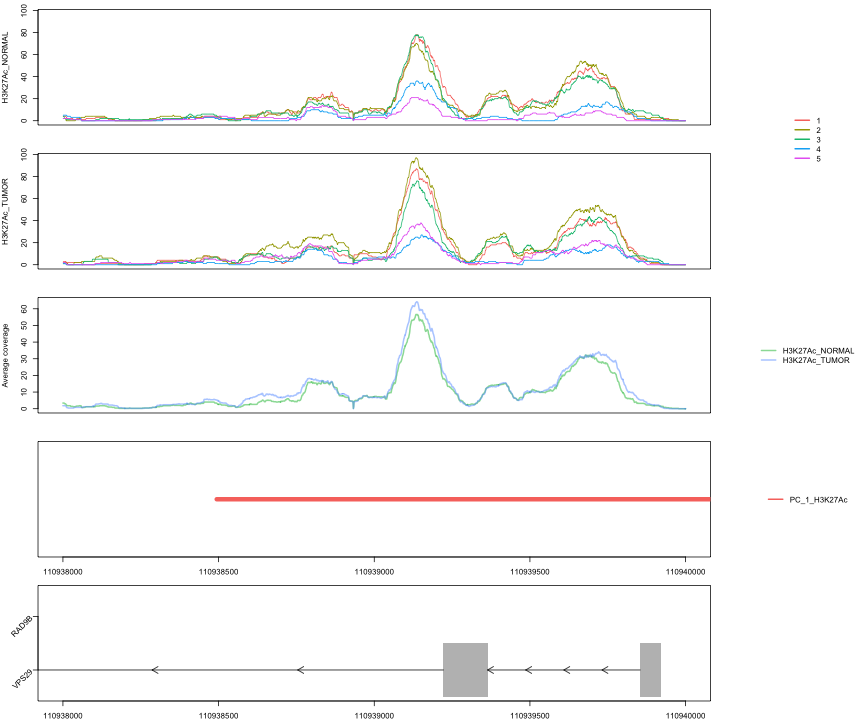

## Introduction

DNA sequencing has become an essential part of biomedicine and biology. Commonly, the data are analyzed with automatized pipelines. However, a visual inspection by a researcher is often useful both at the level of basic quality control and as a confirmation of the analysis results. Efficient visualization often has an essential role also in guiding the analysis design and interpretation of the results.
In an effort to reduce the amount of data in the visualization output and to optimize the information for the user, we have developed a replicate driven tool, RepViz, which enables to view a genomic region in a simple and efficient way. RepViz allows simultaneous viewing of both intra- and intergroup variation in sequencing counts of the studied conditions, as well as their comparison to the output features (e.g. identified peaks) from user selected data analysis methods. The RepViz tool is primarily designed for chromatin data such as ChIP-seq and ATAC-seq, but can also be used with other sequencing data such as RNA-seq, or combinations of different types of genomic data.

## The input files

The tool takes two CSV files as an input. Those CSV files are filled with the path to the different files needed for RepViz. There is one that points to the BAM files and organises them by group and the second points to the BED files. You can see bellow an exemple of the BAM_input.csv containing 3 columns, the path to the BAM files, the group number that is a numeric and the group names.  

### The BAM input file:

```r
BAM_table <- read.table(system.file("extdata","BAM_input.csv", package = "RepViz"), sep = ";")
colnames(BAM_table) <- c("bam file","group","group name")
knitr::kable(BAM_table)
```


|bam file   | group|group name     |
|:----------|-----:|:--------------|
|rep1_1.bam |     1|H3K27Ac_NORMAL |
|rep2_1.bam |     1|H3K27Ac_NORMAL |
|rep3_1.bam |     1|H3K27Ac_NORMAL |
|rep4_1.bam |     1|H3K27Ac_NORMAL |
|rep5_1.bam |     1|H3K27Ac_NORMAL |
|rep1_2.bam |     2|H3K27Ac_TUMOR  |
|rep2_2.bam |     2|H3K27Ac_TUMOR  |
|rep3_2.bam |     2|H3K27Ac_TUMOR  |
|rep4_2.bam |     2|H3K27Ac_TUMOR  |
|rep5_2.bam |     2|H3K27Ac_TUMOR  |

You can see bellow an exemple of the BED_input.csv containing 2 columns, the path to the BED files and the name that will appear in the legend. For the purpose of this exemple it contains only one line, but it is meant to contain multiple lines.
### The BED input file

```r
BED_table <- read.table(system.file("extdata","BED_input.csv", package = "RepViz"), sep = ";")
colnames(BED_table) <- c("bed file","Legend")
knitr::kable(BED_table)
```


|bed file       |Legend       |
|:--------------|:------------|
|consensus2.bed |PC_1_H3K27Ac |

Note that the BAI files should be present with the BAM files 


```
##  [1] "rep1_1.bam"     "rep1_1.bam.bai" "rep1_2.bam"     "rep1_2.bam.bai"
##  [5] "rep2_1.bam"     "rep2_1.bam.bai" "rep2_2.bam"     "rep2_2.bam.bai"
##  [9] "rep3_1.bam"     "rep3_1.bam.bai" "rep3_2.bam"     "rep3_2.bam.bai"
## [13] "rep4_1.bam"     "rep4_1.bam.bai" "rep4_2.bam"     "rep4_2.bam.bai"
## [17] "rep5_1.bam"     "rep5_1.bam.bai" "rep5_2.bam"     "rep5_2.bam.bai"
```

## The plotting function

Once the CSV input files are ready you need to declare the region that will be drawn. For this exemple we are using the region in the vicinity of the VPS29 gene. The library GenomicRanges will be used to create a GRanges object containing the region. The genome need to be specified in order to have the genomic track matching your other tracks (BAM, BED), the genomes that are currently implemented are hg19, hg38 and mm10. The arguments avgTrack and geneTrack are logical and enables you to control if the gene track and average track are ploted or not.


```r
region <- GRanges("chr12:110938000-110940000")
backup <- getwd()
setwd(system.file("extdata", package = "RepViz"))
RepViz::RepViz(region = region,
               genome = "hg19",
               BAM = "BAM_input.csv",
               BED = "BED_input.csv",
               avgTrack = T,
               geneTrack = T)
```

```
## loading the BAM related data from BAM_input.csv
## loading the BED related data from BED_input.csv
## plotting the coverages
```

```
## plotting the BED files 
## overlapping peaks with region 
## load the peak files
```

```
## plotting the gene track
```



This line sets the working directory back in his original place

```r
setwd(backup)
```
 